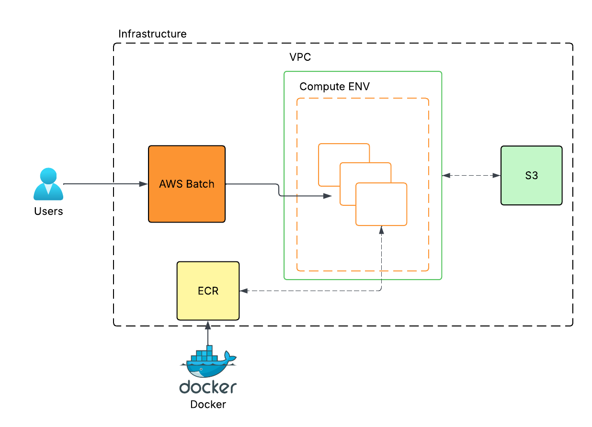

# 🛠️ Usage Guide — Protex DataBuilder CLI

This guide walks you through using the dataset generation pipeline via the Typer CLI.

## 📦 Requirements

- Python 3.10+
- [Poetry](https://python-poetry.org/) for dependency management
- ffmpeg (installed automatically in Docker or manually via `apt`/`brew`)

## 🐍 Running the CLI Locally

First, install dependencies:

```bash
make env-install
```

Then, run the CLI pipeline:

```bash
make run
```

Alternatively:

```bash
poetry run python -m pipeline.cli run \
  --video data/videos/timelapse_test.mp4 \
  --output outputs/frames \
  --coco_output outputs/detections/detections.coco.json \
  --reports_output reports \
  --pretag \
  --blur-detection \
  --dedup-detection
```

## ⚙️ CLI Options

| Option                  | Description                                                | Required |
| ----------------------- | ---------------------------------------------------------- | -------- |
| `--video, -v`           | Path to the input video file                               | ✅       |
| `--output, -o`          | Directory to save extracted frames                         | ✅       |
| `--coco_output, -co`    | Output path for COCO annotations                           | ✅       |
| `--reports_output, -ro` | Directory to store the summary report                      | ✅       |
| `--pretag`              | Enable YOLOv8 detection and generate annotations           | Optional |
| `--blur-detection`      | Remove blurry frames using Laplacian threshold             | Optional |
| `--dedup-detection`     | Remove near-duplicate frames using perceptual hashing      | Optional |
| `--skip`                | Extract every nth frame (default: 1)                       | Optional |
| `--config`              | Path to custom model config YAML                           | Optional |
| `--env`                 | Config environment: `dev`, `test`, `prod` (default: `dev`) | Optional |

## 📁 Outputs

After successful execution, the CLI produces:

- Extracted frames → `outputs/frames/*.jpg`
- Preprocessed frames → `outputs/frames/proprocessed_frames/*.jpg`
- COCO annotation file → `outputs/detections/*.coco.json`
- Markdown report → `reports/report_sample.md`

## 🐳 Running via Docker

Make sure your input video is placed in `data/videos/` and shared with the container:

```bash
make build        # Build Docker image
make docker-run   # Run the pipeline
```

Alternatively:

```bash
docker run --rm -t \
  -v $(pwd)/data/videos:/data/videos \
  -v $(pwd)/outputs:/outputs \
  -v $(pwd)/reports:/reports \
  dataset-pipeline \
  --video /data/videos/timelapse_test.mp4 \
  --output /outputs/frames \
  --coco_output /outputs/detections/detections.coco.json \
  --reports_output /reports \
  --pretag \
  --blur-detection \
  --dedup-detection
```

## 🧪 Testing

```bash
make test           # Unit tests
make test-coverage  # With coverage report
make lint-check     # ruff + black formatting checks
make lint-fix       # ruff + black formatting fixes
make precommit      # Run all pre-commit hooks
```

## 📈 Comet-ML Integration (Optional)

To log metrics to [Comet](https://www.comet.com/), export your API key:

```bash
export COMET_API_KEY="your-api-key"
make run-pipeline-comet
```

Alternatively to more detailed configuration:

```bash
poetry run python -m pipeline.cli \
    --video data/videos/timelapse_test.mp4 \
    --output outputs/frames \
    --coco_output outputs/annotations.coco.json \
    --reports_output reports \
    --pretag \
    --blur-detection \
    --dedup-detection \
    --comet \
    --experiment-name dataset-generation
```

Comet will track:

- Frame counts, drop ratios
- Pre-tagging detection stats
- Time breakdown of pipeline stages
- Report contents (Markdown)

## ✅ Tips

- Use `--skip 5` or higher to sample long videos
- Use `--blur-detection` + `--dedup-detection` for high-quality dataset curation
- To customize detection model and thresholds, use `--config path/to/config.yaml`

## ❓ Need Help?

Run the following for full CLI help:

```bash
poetry run python -m pipeline.cli run --help
```

## ☁️ Infrastructure (Terraform)

Supports modular AWS deployment:

- `ECR`: Store container images
- `EC2`: Run inference jobs
- `Batch`: Scalable pre-tagging at scale (enabled in `prod`)

### Environments

```bash
cd infra/aws/envs/dev      # or infra/aws/envs/prod

terraform init
terraform plan
terraform apply
```

Customize per env in `terraform.tfvars`.

## 🗺️ Architecture Diagram

<p align="left">
  
</p>
